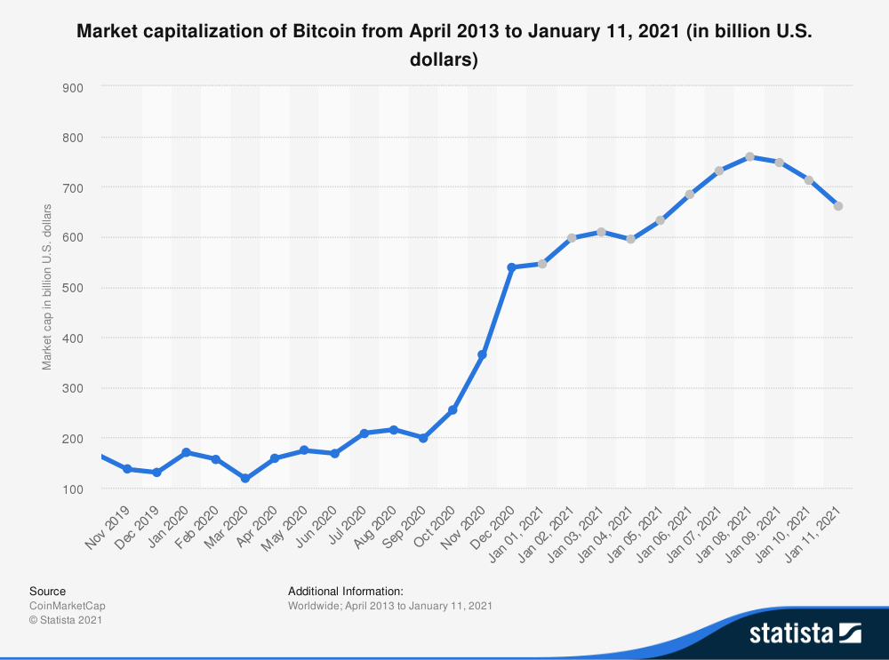

# 💸 Why study the Bitcoin and Cryptocurrencies?

Since the [launch of Bitcoin in 2008](https://newfronttest.bitcoin.com/bitcoin.pdf), hundreds of similar projects based on the blockchain technology have emerged. We call these cryptocurrencies (also coins or cryptos in the Internet slang). Some are extremely valuable nowadays, and others may have the potential to become extremely valuable in the future. In fact, according to the [Statista](https://www.statista.com/statistics/377382/bitcoin-market-capitalization) portal the 7th of January of 2021, Bitcoin has a [market capitalization](https://en.wikipedia.org/wiki/Market_capitalization) above $730 billion. 

  

However, the cryptocurrency market is exceptionally volatile and any money you put in might disappear into thin air. Cryptocurrencies mentioned here might be scams similar to [Ponzi Schemes](https://en.wikipedia.org/wiki/Ponzi_scheme) or have many other issues (overvaluation, technical, etc.). So, please **do not mistake this for investment advice**. The objectives of this project are merely informative.

# 🌟 About this project

This project was made with the intention to get a complement for the several abilities learned from courses taken on [DataCamp](https://www.datacamp.com/) platform. Some of those skills include:

- ✅ Data extraction through APIs in order to get the updated data.
- ✅ Data manipulation to define and obtain the useful information for this analysis.
- ✅ Data visualization for better interpretations.
- ✅ Exploratory data analysis for understand some aspects of the cryptocurrencies market capitalization.
  
